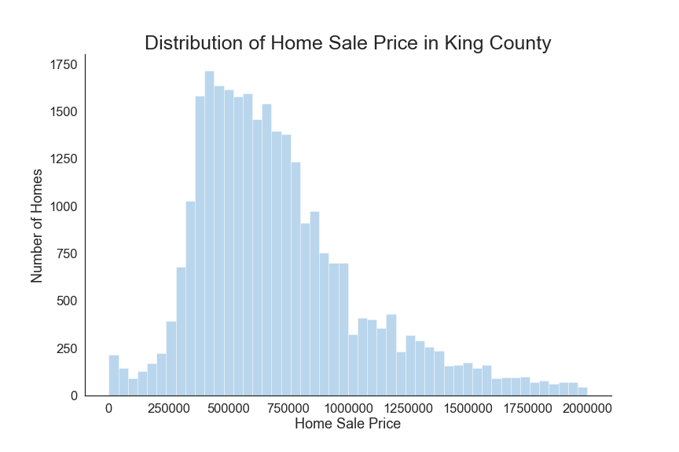
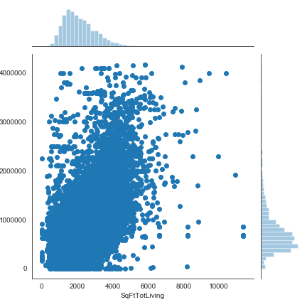

# Table of Contents
- [Exploratory Notebooks](https://github.com/mattcarr17/mod_2_flatiron_project/tree/master/notebooks/exploratory)
- [Report Notebook](https://github.com/mattcarr17/mod_2_flatiron_project/blob/master/notebooks/report/final_notebook.ipynb)
- [Project Presentation](https://github.com/mattcarr17/mod_2_flatiron_project/blob/master/report/Presentation.pdf)
- [Data download](https://github.com/mattcarr17/mod_2_flatiron_project/blob/master/notebooks/exploratory/01_mc_data_download.ipynb)
- [src/ directory with project source code](https://github.com/mattcarr17/mod_2_flatiron_project/tree/master/src)
- [figures/ directory with project visuals](https://github.com/mattcarr17/mod_2_flatiron_project/tree/master/report/figures)
- [Data references](https://github.com/mattcarr17/mod_2_flatiron_project/tree/master/references)
- [Project Conda environment](https://github.com/mattcarr17/mod_2_flatiron_project/blob/master/environment.yml)

# Context of Project
Our project task was to create a linear regression model providing insight into what influenced the sale price of homes in King County. Specifically, we wanted to explore the effect having a porch, being on the waterfront, and the presence of nuisances (power lines, traffic noise, airport noise, etc) had on home sale price. In order to accomplish the project task we created a multiple linear regression model to determine what influence each of these had on the sale price of a home. In addition to these three claims we also explored the effects of location and home quality.

Our analysis was done with the intention of providing insight on housing price indicators for potential homebuyers in King County. To taylor our analysis more towards the average homebuyer we focused on the less extreme home sale prices by removing necessary outliers from our dataset.

The data used in this analysis can be found at [King County Department of Assessments](https://info.kingcounty.gov/assessor/DataDownload/default.aspx). The specific data used will be introduced later.

# Project Plan
As discussed earlier our model was to provide insight on housing price indicators for potential homebuyers. In order to do this we needed to create the most accurate model possible. After exploring the dataset, we found a strong correlation between the total square footage of a home and it's sale price. We decided to create a baseline model that used total square footage to predict the sale price of a home. We then used this model to judge the effectiveness of our contious iterations off of.

After creating our baseline model and following every model iteration, we needed to test the assumptions of linear regression to ensure our analysis was statistically significant. We performed a rainbow fit test to check the linearity between the features and target variables, the Jarque-Bera test to check for normality of the residuals from the resulting model, the Breuch-Pagan test to check for homoscedasticity, and calculated variance inflation factor to check for multicollinearity between the model's features. We then used these assumptions to improve the next iteration of our model.

# Preview of Results
The primary purpose of our analysis was to explore the influence of different home features on sale price. Because of this we found it beneficial to have an idea of the different sale prices in King County.

The graph shows the distribution of home sale price in King County. As mentioned earlier we tried to taylor our analysis towards the average home buyer. Because of this we investigated home's under $2 million. As you can see from the distribution, homes in King County are rather expensive overall. The majority of homes fall between $400,000 and $1 million. 

One thing we wanted to explore was the effects of home quality on home price. To do this we utlized the Building Grade column, which divided up the homes as follows:

As you can see from the graph above, the average sale price of a home varies depending on the type of home and the quality. This is valuable information as home buyers can see the average sale price of a home according to their home type interest. If a wealthy homebuyer is looking for a mansion or nice luxurious home, they can expect to spend around $2 million to $3 million dollars. If someone was looking for an nice, average home they could expect to spend $400,000 to $1 million. For someone who is looking for a lower quality home as a resell opportunity, they can expect to spend between $50,000 to $200,000.

# Data
We utilized three datasets for our analysis, all of which can be found at [King County Department of Assessments](https://info.kingcounty.gov/assessor/DataDownload/default.aspx). The specific datasets used are as follows:
- [Real Property Sales](https://aqua.kingcounty.gov/extranet/assessor/Real%20Property%20Sales.zip)
- [Residential Buildings](https://aqua.kingcounty.gov/extranet/assessor/Residential%20Building.zip)
- [Parcel](https://aqua.kingcounty.gov/extranet/assessor/Parcel.zip)

The Real Property Sales dataset provided a information on property sale transactions in King County such as sale date and price. The Residential Buildings dataset provided general information on the homes that were sold in King County such as total square footage and number of bedrooms. The Parcel dataset gave information on the property a given home was located, such as if it was located on a waterfront or any nuisances were present. All three datasets contained a 'Major' and 'Minor' column which were the identifying variables for the data. These were the columns used to combine the datasets together. The specific columns we used from each dataset are as follows (not including the 'Major' and 'Minor' columns):
Real Property Sales:
- SalePrice

Residential Buildings:
- SqFtTotLiving
- SqFtOpenPorch
- SqFtEnclosedPorch
- BldgGrade
- Bedrooms
- BathFullCount
- BathHalfCount
- SqFtGarageAttached
- NbrLivingUnits

Parcel:
- TrafficNoise
- PowerLines
- OtherNuisances
- TidelandShoreland
- Township
- SqFtLot
- LakeWashington
- WfntLocation

As stated earlier the datasets contains information on all property sales in King County. For the purpose of our analysis we focused only on those from 2019, so our resulting dataframe was filtered to contain only the information on home sales from 2019.

# Process
Utilizing the Python programming language and various libraries from this language we processed the data to create the most accurate model of home sale price in King County as possible. We began by selecting only the property sales that occured in 2019. We then removed any extreme outliers. Our final model contained data on any sale where the price was above $150,000 and below $1.3 million.

After exploring the correlation of different variables with the sale price of a home, we found total home square footage to be highly correlated. Because of this we decided to create our baseline model on the effects total square footage had on home sale price. Once we had our baseline model and checked the assumptions of linear regression we iterated over this model, experimenting with different features to obtain the most accurate model. Throughout this process we performed different variations of feature scaling and feature encoding.

The final model contained the columns on Building Grade, number of living units, waterfront location, bath count, tideland and shoreland, township, porch, and presence of nuisances. For the final model we encoded all of these categorical variables and power transformed the sale price data.

# Baseline Model
The baseline model predicted the home sale price based on total square footage. The model had a R-Squared of .84 and a JB OF (27,295.9). The predictor variable, total living sqft had a p-value of 0, indicating it was statistically significant. The model failed to meet the assumptions.

# Final Model
The final model was an attempt at addressing the 3 claims. The variables we chose to stick with for this model were:
- Sale Price
- Encoded Building Grade
- Encoded Number of Living Units
- Encoded View of Lake Washington
- Encoded Full Bath Count
- Encoded Half Bath Count
- Encoded Tideland Shoreland
- Encoded Township
- Encoded Waterfront Location
- Encoded Has Porch
- Encoded Power Lines
- Encoded Traffic Noise
- Encoded Other Nuisances
All of the variables had a p-value less than .025, indicating they were statistically significant for the model.
The model had a R-Squared of .64 and a JB of (95.62).

Rainbow test statistic: 1.0040602671788623
Rainbow test p-value: 0.4094584520205275
JB test statistic: 95.87354233066809
JB test p-value: 1.5181853721229675e-21
Breusch Pagan test statistic: 1943.5195735373645
Breusch Pagan p-value: 0.0
VIF: 0.6989291545047718

The final model met the linearity and independence assumptions while failing to meet the normality and homoscedasticity assumptions.

# Application and Next Steps
We hope potential home buyers in King County can use our analysis to make the most informed decision possible when purchasing a home. Our model provided insight on which home features most influenced home price as well as how home price varied across different areas in King County. With this information, a potential home buyer can make a more educated decision on what home features they would most like to have as well as what area they would like to purchase a home given their purchasing budget.

To continue our analysis we would have liked to explore the effects of different features on home sale price. For example how the quality of schools in given area or the crime rate my influence the home prices of that area. We would have also liked to investigate how prices fluctuate over time, and when the best time to buy a home may be.
